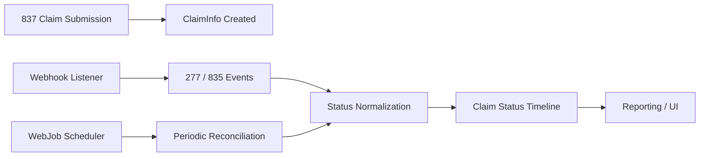
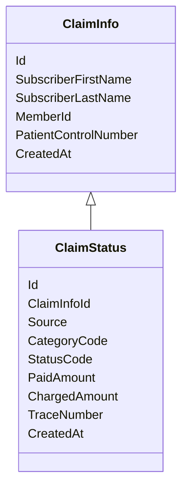

# Insurance Claim Lifecycle Tracking System  
# 보험 청구 라이프사이클 추적 시스템

---

## Project Overview | 프로젝트 개요

This project is an **insurance claim lifecycle tracking and reconciliation system** designed to reliably manage medical claim submissions, adjudication status updates, and payment processing.

본 프로젝트는 **의료 보험 청구의 전체 라이프사이클을 추적하고 정산을 관리하는 시스템**입니다.

The system integrates:

- **837 (Claim Submission / 청구 제출)**
- **277 (Claim Status / 청구 상태 조회)**
- **835 (ERA Payment / 전자 지급 명세)**

into a **single, traceable claim timeline**.

이를 하나의 **추적 가능한 청구 타임라인**으로 통합합니다.

**Team Size:** 2 Developers  
**My Role:** Batch processing & data synchronization (WebJob)  
**Teammate Role:** Real-time processing via Webhooks  

---

## 팀 협업 및 역할 분담

### Developer A (Teammate)

- Implemented **Webhook-based real-time ingestion**
- Processed:
  - Incoming 277 Claim Status notifications
  - Incoming 835 ERA payment events
- Ensured near real-time visibility of payer responses

Webhook 기반 실시간 수집 시스템 구현  
277 상태 알림 및 835 지급 이벤트 처리  
지급자 응답에 대한 거의 실시간 가시성 확보  

---

### 👨‍💻 Developer B (Me)

- Designed and implemented **WebJob-based batch synchronization**
- Periodically fetched updated EDI transactions
- Reconciled missed or delayed webhook events
- Ensured data consistency and completeness

WebJob 기반 배치 동기화 시스템 설계 및 구현
누락/지연 Webhook 이벤트 보정
데이터 정합성 및 완전성 보장

Focused on:

- Idempotent processing  
- Deduplication logic  
- Historical correctness  

---

## UI Overview | UI 구성

- Claim submission & overview screens  
- Status timeline & payment views  

- 청구 제출 및 개요 화면  
- 상태 타임라인 및 지급 내역 화면  

### UI Example | UI 예시


Backend APIs were designed to support both UI domains consistently.  
백엔드 API는 두 UI 영역을 일관되게 지원하도록 설계되었습니다.

---

## 비즈니스 문제

Insurance claim processing is asynchronous and fragmented:

- Claims are submitted (837)  
- Status updates arrive later (277)  
- Payments arrive separately (835)  
- Partial payments and reversals are common  

보험 청구 처리는 비동기적이며 분절되어 있습니다.

- 837 청구 제출  
- 이후 277 상태 업데이트 도착  
- 835 지급 및 조정 정보 별도 도착  
- 부분 지급 및 반전(Reversal) 빈번  

Without a unified system:

- Claim traceability is lost  
- Payment reconciliation becomes manual  
- Auditing becomes unreliable  

---

## 솔루션 요약

The system:

- Treats **837 as the source of truth**  
- Correlates 277 and 835 using **Subscriber Name + Member ID**  
- Normalizes all events into a **single immutable status timeline**  
- Supports both **real-time (Webhook)** and **batch (WebJob)** processing  
- Preserves full history for audit and analysis  

본 시스템은:

- **837을 기준 데이터로 설정**  
- **Subscriber Name + Member ID** 기준 매칭  
- 모든 이벤트를 **Immutable 상태 타임라인**으로 정규화  
- 실시간 + 배치 하이브리드 처리  
- 감사 및 분석을 위한 전체 이력 보존  

---

## High-Level Architecture | 상위 아키텍처



---

## 🔄 Core Data Flow

### 1️⃣ 837 – Claim Submission / 청구 제출

- Creates `ClaimInfo`  
- Initial status: **SUBMITTED**

### 2️⃣ 277 – Claim Status Update / 상태 업데이트

- Arrives via Webhook or WebJob  
- Uses `CategoryCode + StatusCode`  

Deduplicated by:

```
(ClaimInfoId, CategoryCode, StatusCode)
```

### 3️⃣ 835 – ERA Payment / 지급 처리

- Contains payment & adjustment data  
- Business status derived from payment amounts  

Deduplicated by:

```
(ClaimInfoId, StatusCode)
```

---

## Matching Strategy

Deterministic Keys:

```
Subscriber First Name
+ Subscriber Last Name
+ Member ID
```

- Consistent across 837 / 277 / 835  
- Independent of payer-specific identifiers  
- Reliable cross-transaction correlation  

---

## ⚙ Implementation Details | 구현 상세

### Batch Processing (My Contribution)

- Scheduled WebJobs  
- Backfill logic for missed webhook events  
- Idempotent write design  
- Policy-based deduplication  
- Historical reprocessing safety  

### Real-Time Processing (Teammate)

- Webhook endpoints  
- Payload validation  
- Immediate persistence  
- Latency reduction  

---

## Data Model (Simplified) 



---

## Tech Stack

### Backend
- ASP.NET Core
- C#
- Entity Framework Core
- Azure WebJobs
- Webhook APIs
- AWS Lambda

### Integration
- EDI (X12 837 / 277 / 835)
- Stedi API

### Database
- MySQL
- DynamoDB  
- Indexed deduplication keys  
- Immutable history model  

---

## Key Engineering Decisions

1. **Webhook + WebJob Hybrid Architecture**  
   - Real-time responsiveness  
   - Guaranteed eventual consistency  

2. **Immutable Status History**  
   - Full audit trail  
   - Easy investigation  

3. **Policy-Based Deduplication**  
   - Centralized logic  
   - Extensible design  

4. **Batch-Oriented DB Writes**  
   - Performance optimized  
   - Safe for large volumes  

---

## Results

- Reliable claim lifecycle tracking  
- Accurate payment reconciliation  
- Reduced operational overhead  
- Clear audit trail  
- Scalable ingestion architecture  

---

## 프로젝트 역량

- Healthcare domain expertise  
- Distributed system design  
- Event-driven + batch hybrid architecture  
- Backend reliability ownership  
- Multi-developer collaboration  

---

## Author Contribution

- Designed batch reconciliation strategy  
- Implemented WebJob ingestion pipeline  
- Built deduplication and idempotency logic  
- Co-developed backend APIs for UI consumption  
