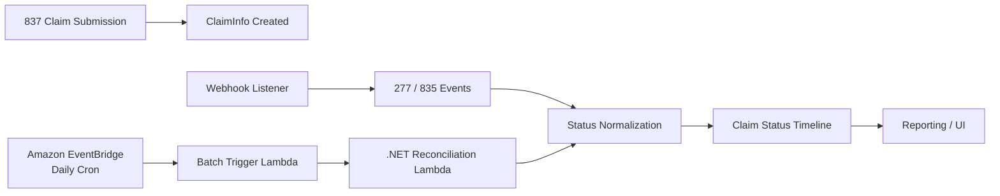
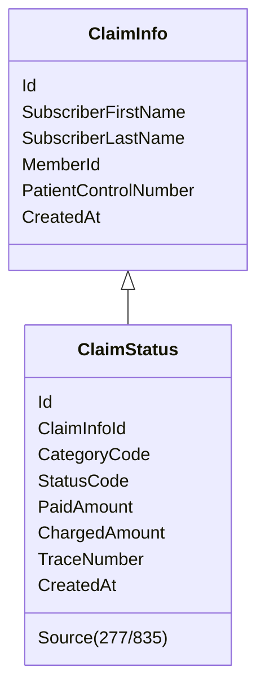

# Insurance Claim Lifecycle Tracking System

[한국어 🇰🇷](README.Ko.md)

---

## Project Overview

This project is an **insurance claim lifecycle tracking and reconciliation system** designed to reliably manage medical claim submissions, adjudication status updates, and payment processing.

The system integrates:

- **837 (Claim Submission)**
- **277 (Claim Status)**
- **835 (ERA Payment)**

into a **single, traceable and immutable claim timeline**.

The goal of the system is to guarantee:

- End-to-end claim traceability  
- Accurate payment reconciliation  
- Operational reliability  
- Audit-ready historical tracking  

**Team Size:** 2 Developers  
**My Role:** Batch processing & data synchronization  
**Teammate Role:** Real-time processing via Webhooks  

---

## Business Problem

Insurance claim processing is inherently asynchronous and fragmented:

- Claims are submitted (837)
- Status updates arrive later (277)
- Payments and adjustments arrive separately (835)
- Transactions use different identifiers
- Partial payments and reversals are common

Without a unified lifecycle system:

- Claim traceability is lost
- Payment reconciliation becomes manual
- Operational risk increases
- Auditing becomes unreliable

---

## Solution Overview

This system:

- Treats **837 as the anchor (source of truth)**
- Correlates 277 and 835 using **Subscriber Name + Member ID**
- Normalizes all events into a **single immutable claim status timeline**
- Supports both **real-time (Webhook)** and **scheduled batch reconciliation**
- Guarantees eventual consistency even if real-time events fail

---

## System Architecture

### Hybrid Processing Model

The system uses a **Webhook + Scheduled Batch Hybrid Architecture**.

- Webhooks handle near real-time updates  
- Scheduled batch jobs guarantee reconciliation and completeness  

---

## Scheduled Execution Architecture  
### EventBridge → Batch Lambda → .NET Reconciliation Lambda (Daily Execution)

To ensure historical correctness and reconciliation of missed events, batch processing runs automatically once per day using an AWS-native serverless architecture.

### Execution Flow

1. **Amazon EventBridge**
   - Configured with a daily cron rule
   - Acts as the centralized scheduler

2. **Batch Trigger Lambda**
   - Invoked by EventBridge
   - Lightweight orchestration layer
   - Responsible for invoking the reconciliation Lambda

3. **.NET Reconciliation Lambda**
   - Contains the actual batch handler logic
   - Fetches updated 837 / 277 / 835 transactions
   - Reconciles missed webhook events
   - Performs policy-based deduplication
   - Ensures idempotent persistence

---

## Architecture Diagram



---

## Core Data Flow

### 1. 837 – Claim Submission

- Outbound claim submission
- Creates `ClaimInfo`
- Initial status: **SUBMITTED**

---

### 2. 277 – Claim Status Update

- Arrives via Webhook or Reconciliation Lambda
- Provides adjudication progress
- Uses `CategoryCode + StatusCode`

Deduplicated by:

```
(ClaimInfoId, CategoryCode, StatusCode)
```

---

### 3. 835 – ERA Payment

- Arrives via Webhook or Reconciliation Lambda
- Contains payment & adjustment data
- Business status derived from payment amounts

Deduplicated by:

```
(ClaimInfoId, StatusCode)
```

---

## Matching Strategy

### Deterministic Matching Keys

```
Subscriber First Name
+ Subscriber Last Name
+ Member ID
```

Chosen because:

- Consistent across 837 / 277 / 835
- Independent of payer-specific identifiers
- Reliable cross-transaction correlation

---

## Implementation Details

### Batch Processing (My Contribution)

- Implemented daily batch reconciliation using:
  - **Amazon EventBridge (cron scheduler)**
  - **Batch Trigger Lambda (orchestration layer)**
  - **.NET AWS Lambda (reconciliation handler)**
- Designed policy-based deduplication
- Implemented idempotent write logic
- Built reconciliation logic for missed webhook events
- Enabled safe historical reprocessing
- Optimized batch-oriented database writes

### Real-Time Processing (Teammate Contribution)

- Implemented webhook endpoints
- Validated incoming payloads
- Performed immediate persistence
- Reduced system latency
- Ensured reliable event-driven updates

---

## Data Model (Simplified)



---

## UI Overview

UI responsibilities were split by feature domain:

- Claim submission & overview screens
- Status timeline & payment views


Backend APIs were designed to consistently support both UI segments.

---

## Tech Stack

### Backend
- ASP.NET Core
- C#
- Entity Framework Core
- AWS Lambda (.NET)
- Amazon EventBridge
- Webhook APIs

### Integration
- EDI (X12 837 / 277 / 835)
- Stedi API (JSON artifacts)

### Database
- MySQL Server
- DynamoDB Server
- Indexed deduplication keys
- Immutable history model

---

## Key Engineering Decisions

1. **Webhook + Scheduled Batch Hybrid Architecture**
   - Real-time responsiveness
   - Guaranteed eventual consistency

2. **EventBridge → Lambda Orchestration Model**
   - Fully AWS-native scheduling
   - Decoupled trigger and business logic layers
   - Serverless and scalable execution model

3. **Immutable Status History**
   - Full audit trail
   - Safe reprocessing
   - Easy investigation

4. **Policy-Based Deduplication**
   - Centralized and extensible logic
   - No duplicate status records

5. **Batch-Oriented DB Writes**
   - Performance optimized
   - Safe for high-volume ingestion

---

## Results

- Reliable claim lifecycle tracking
- Accurate payment reconciliation
- Reduced operational overhead
- Clear audit trail for compliance
- Automated daily reconciliation pipeline
- Scalable and resilient ingestion architecture

---

## What This Project Demonstrates

- Real-world healthcare domain expertise
- Distributed system design
- Hybrid event-driven + batch architecture
- Idempotent data engineering practices
- AWS serverless orchestration design
- Strong backend ownership and reliability mindset

---

## Author Contribution Summary

- Designed overall batch reconciliation strategy
- Architected EventBridge → Lambda orchestration pipeline
- Implemented .NET reconciliation Lambda handler
- Built centralized deduplication policy logic
- Developed reconciliation and backfill mechanisms
- Co-developed backend APIs for UI consumption
