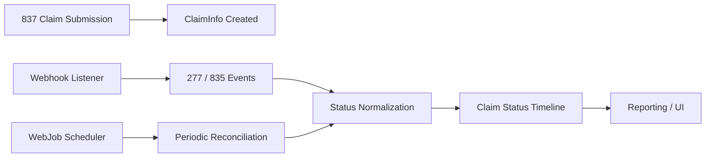
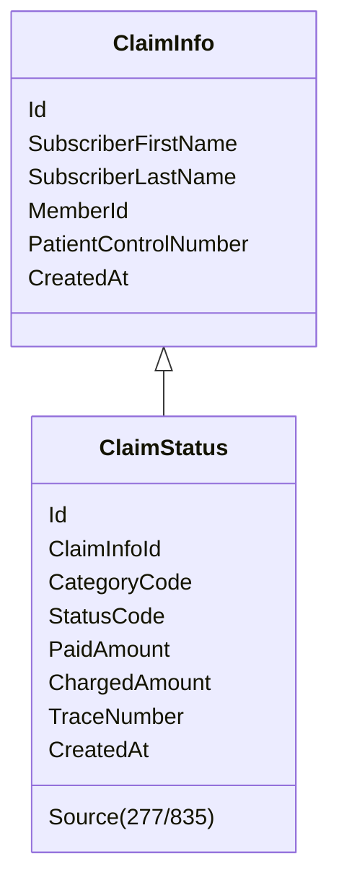

# Insurance Claim Lifecycle Tracking System

## Project Overview

This project is an **insurance claim lifecycle tracking and reconciliation system** designed to
reliably manage medical claim submissions, adjudication status updates, and payment processing.

The system integrates **837 (Claim Submission), 277 (Claim Status), and 835 (ERA Payment)** transactions
into a **single, traceable claim timeline**.

**Team Size:** 2 Developers  
**My Role:** Batch processing & data synchronization (WebJob)  
**Teammate Role:** Real-time processing via Webhooks  

---

## Team Collaboration & Role Distribution (Very Important)

### Developer A (Teammate)
- Implemented **Webhook-based real-time ingestion**
- Processed:
  - Incoming 277 Claim Status notifications
  - Incoming 835 ERA payment events
- Ensured:
  - Near real-time visibility of payer responses
  - Immediate persistence of event-driven updates

### Developer B (Me)
- Designed and implemented **WebJob-based batch synchronization**
- Responsibilities:
  - Periodically fetch updated transactions from the EDI provider
  - Reconcile missed or delayed webhook events
  - Ensure data consistency and completeness
- Focused on:
  - Idempotent processing
  - Deduplication logic
  - Historical correctness

### UI Development
- UI responsibilities were **split by feature domain**
  - Claim submission & overview screens
  - Status timeline & payment views
  - UI example(one of the whole system)
  - 

- Backend APIs were designed to support both UI segments consistently

---

## Business Problem

Insurance claim processing is asynchronous and fragmented:

- Claims are submitted (837)
- Status updates arrive later (277)
- Payments and adjustments arrive separately (835)
- Each transaction uses different identifiers
- Partial payments, reversals, and reprocessing are common

Without a unified system:
- Claim traceability is lost
- Payment reconciliation becomes manual
- Auditing is unreliable

---

## Solution Summary

This system:
- Treats **837 as the anchor (source of truth)**
- Correlates 277 and 835 using **Subscriber Name + Member ID**
- Normalizes all events into a **single immutable status timeline**
- Supports both **real-time (Webhook)** and **batch (WebJob)** processing
- Preserves full history for audit and analysis

---

## High-Level Architecture



---

## Core Data Flow

### 1. 837 – Claim Submission
- Outbound claim submission
- Creates `ClaimInfo`
- Initial status: **SUBMITTED**

### 2. 277 – Claim Status Update
- Arrives via Webhook or WebJob
- Provides adjudication progress
- Uses `CategoryCode + StatusCode`
- Deduplicated by `(ClaimInfoId, CategoryCode, StatusCode)`

### 3. 835 – ERA Payment
- Arrives via Webhook or WebJob
- Contains payment & adjustment data
- Business status derived from payment amounts
- Deduplicated by `(ClaimInfoId, StatusCode)`

---

## Matching Strategy

### Deterministic Matching Keys

```text
Subscriber First Name
+ Subscriber Last Name
+ Member ID
```

Chosen because:
- Consistent across 837 / 277 / 835
- Independent of payer-specific IDs
- Reliable for cross-transaction correlation

---

## Implementation Details

### Batch Processing (My Contribution)

- Implemented scheduled WebJobs to:
  - Fetch updated EDI transactions
  - Backfill missing webhook events
  - Reprocess historical data safely
- Designed **deduplication policy functions**
- Ensured:
  - Idempotent writes
  - No duplicate status records
  - Full historical accuracy

### Real-Time Processing (Teammate Contribution)

- Implemented webhook endpoints
- Validated incoming payloads
- Triggered immediate status updates
- Reduced system latency

---

## Data Model (Simplified)



---

## Tech Stack

### Backend
- ASP.NET Core
- C#
- Entity Framework Core
- Async / Parallel Processing
- Azure WebJobs
- Webhook APIs
- AWS Lambda

### Integration
- EDI (X12 837 / 277 / 835)
- Stedi API (JSON artifacts)

### Database
- MySQL Server
- DynamoDB Server
- Indexed deduplication keys
- Immutable history model

---

## Key Engineering Decisions

1. **Webhook + WebJob Hybrid Architecture**
   - Real-time responsiveness
   - Guaranteed eventual consistency

2. **Immutable Status History**
   - Full audit trail
   - Easy rollback and investigation

3. **Policy-Based Deduplication**
   - Centralized logic
   - Easy extensibility

4. **Batch-Oriented DB Writes**
   - Performance optimized
   - Safe for large volumes

---

## Results

- Reliable claim lifecycle tracking
- Accurate payment reconciliation
- Reduced operational overhead
- Clear audit trail for compliance
- Scalable ingestion model

---

## What This Project Demonstrates

- Real-world healthcare domain expertise
- Distributed system design
- Event-driven + batch hybrid processing
- Strong ownership of backend reliability
- Collaboration in a multi-developer environment

---

## Author Contribution Summary

- Designed batch reconciliation strategy
- Implemented WebJob ingestion pipeline
- Built deduplication and idempotency logic
- Co-developed backend APIs for UI consumption
